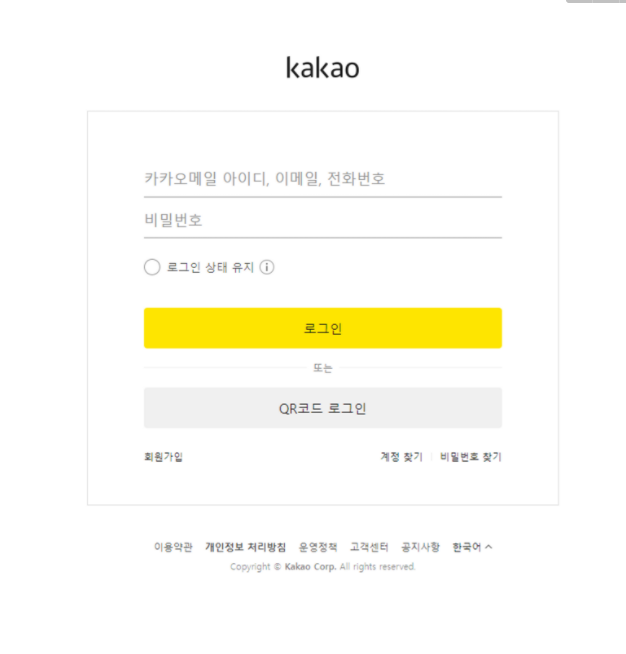
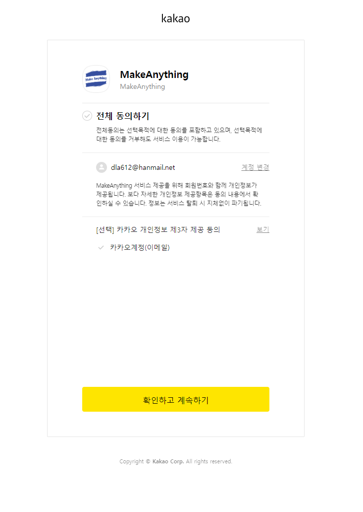
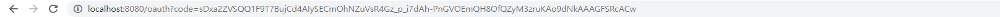

# 카카오 로그인 인증 요청 인가코드 받기

```html
<html>
    <head>
        <meta charset="UTF-8">
        <title>Kakao Login</title>
    </head>
    <body>
        <a href="https://kauth.kakao.com/oauth/authorize?response_type=code&client_id={여기에 REST API KEY를 넣습니다}&redirect_uri=https%3A%2F%2Flocalhost%3A8080%2Foauth">
            Kakao 로그인
        </a>
    </body>
</html>
```







- 카카오에서 지원하는 카카오 로그인 동의 화면 호출이다. 파라미터는 아래와 같다.


    | Name | Type | Description | Required |
    | --- | --- | --- | --- |
    | client_id | String | 앱 REST API 키[내 애플리케이션] > [앱 키]에서 확인 가능 | O |
    | redirect_uri | String | 인가 코드를 전달받을 서비스 서버의 URI[내 애플리케이션] > [카카오 로그인] > [Redirect URI]에서 등록 | O |
    | response_type | String | code로 고정 | O |
    | scope | String | https://developers.kakao.com/docs/latest/ko/kakaologin/rest-api#request-code-additional-consent 요청 시 사용사용자에게 동의 요청할 동의 항목 ID 목록동의 항목의 ID는 https://developers.kakao.com/docs/latest/ko/kakaologin/common#user-info 또는 [내 애플리케이션] > [카카오 로그인] > [동의 항목]에서 확인 가능쉼표(,)로 구분해 여러 개 전달 가능주의: OpenID Connect를 사용하는 앱의 경우, scope 파라미터 값에 openid를 반드시 포함해야 함, 미포함 시 ID 토큰이 재발급되지 않음 (https://developers.kakao.com/docs/latest/ko/kakaologin/common#additional-consent-scope) | X |
    | prompt | String | https://developers.kakao.com/docs/latest/ko/kakaologin/rest-api#request-code-auto-login, https://developers.kakao.com/docs/latest/ko/kakaologin/rest-api#request-code-re-authentication 요청 시 사용동의 화면 요청 시 추가 상호작용을 요청하고자 할 때 전달하는 파라미터쉼표(,)로 구분된 문자열 값 목록으로 전달다음 값 사용 가능:login: 기존 사용자 인증 여부와 상관없이 사용자에게 카카오계정 로그인 화면을 출력하여 다시 사용자 인증을 수행하고자 할 때 사용, 카카오톡 인앱 브라우저에서는 이 기능이 제공되지 않음none: 사용자에게 동의 화면과 같은 대화형 UI를 노출하지 않고 인가 코드 발급을 요청할 때 사용, 인가 코드 발급을 위해 사용자의 동작이 필요한 경우 에러 응답 전달 | X |
    | service_terms | String | https://developers.kakao.com/docs/latest/ko/kakaologin/rest-api#request-code-terms 요청 시 사용동의받을 약관 태그 목록약관 태그는 [내 애플리케이션] > [간편가입]에서 확인 가능쉼표(,)로 구분된 문자열 값 목록으로 전달 | X |
    | state | String | 카카오 로그인 과정 중 동일한 값을 유지하는 임의의 문자열(정해진 형식 없음)https://en.wikipedia.org/wiki/Cross-site_request_forgery 공격으로부터 카카오 로그인 요청을 보호하기 위해 사용각 사용자의 로그인 요청에 대한 state 값은 고유해야 함인가 코드 요청, 인가 코드 응답, 토큰 발급 요청의 state 값 일치 여부로 요청 및 응답 유효성 확인 가능 | X |
    | nonce | String | https://developers.kakao.com/docs/latest/ko/kakaologin/common#oidc를 통해 ID 토큰을 함께 발급받을 경우, https://en.wikipedia.org/wiki/Replay_attack 공격을 방지하기 위해 사용https://developers.kakao.com/docs/latest/ko/kakaologin/common#oidc-id-token-verify 시 대조할 임의의 문자열(정해진 형식 없음) | X |
- 카카오 로그인 인증 요청 폼을 통해 카카오 회원 로그인을 진행할 수 있다. 카카오 로그인 인증 요청 폼에 카카오 계정으로 로그인 하면, 카카오 개발자 페이지에 애플리케이션 redirect_uri로 지정해놓은 곳에 code 값으로 인가 코드를 받게 된다. Redirect_uri로 자동이동되면서 서비스에서 api로 만들어놓은 것이 자동호출되도록 한다.
- **주의해야 할 사항으로는 redirect_uri를 그냥 넣어서는 안되고, URL Encode를 이용하여 넘겨주어야 한다.**

  [URL Encode and Decode - Online](https://www.urlencoder.org/)

( Parameter, Response 출처 : [카카오 개발자 페이지](https://developers.kakao.com/docs/latest/ko/kakaologin/common) )